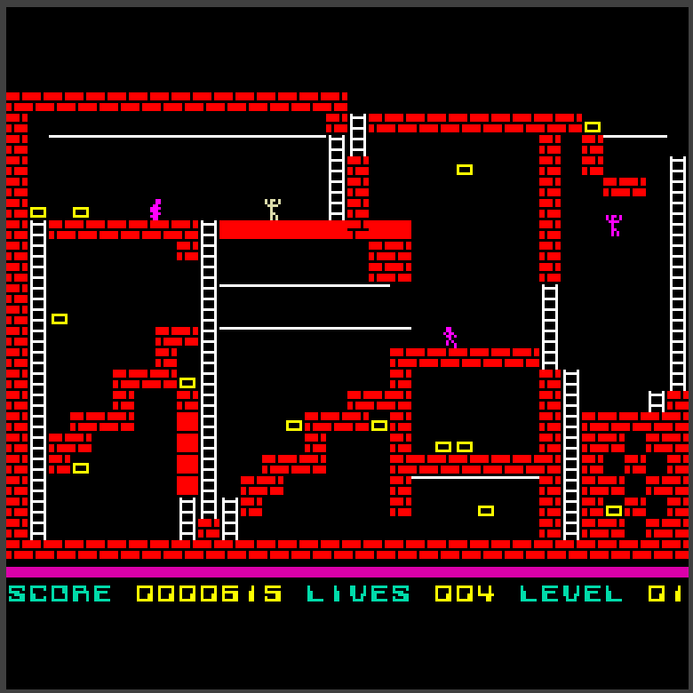
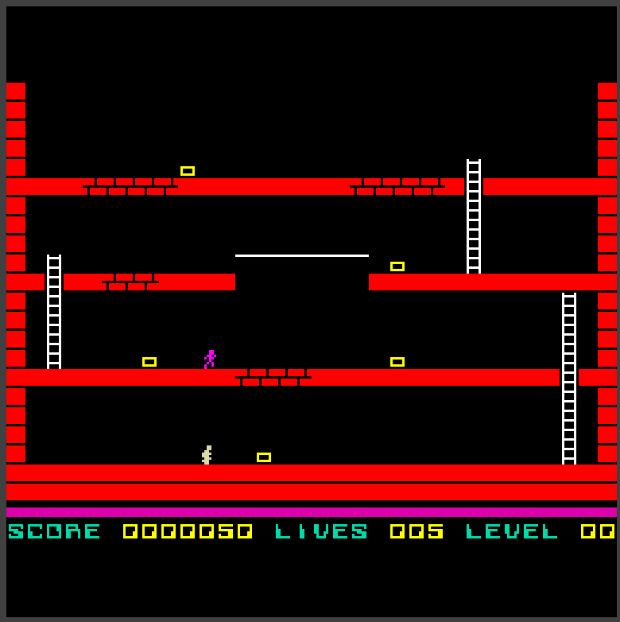
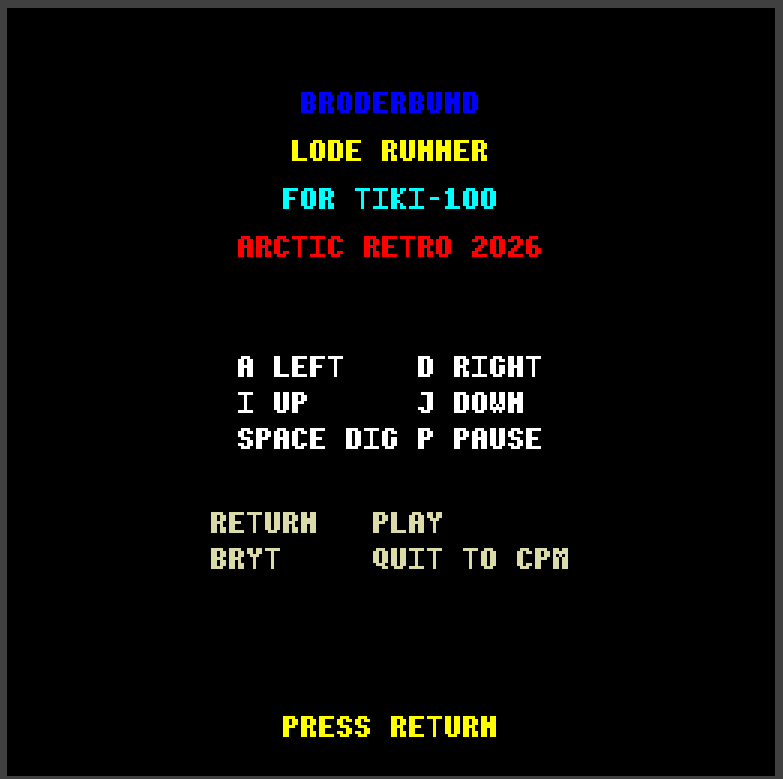
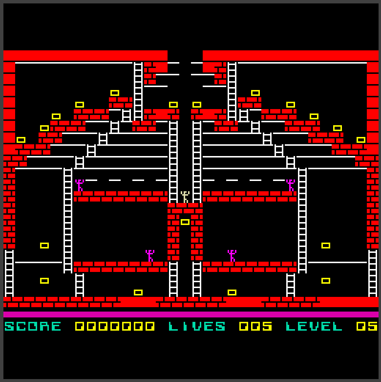
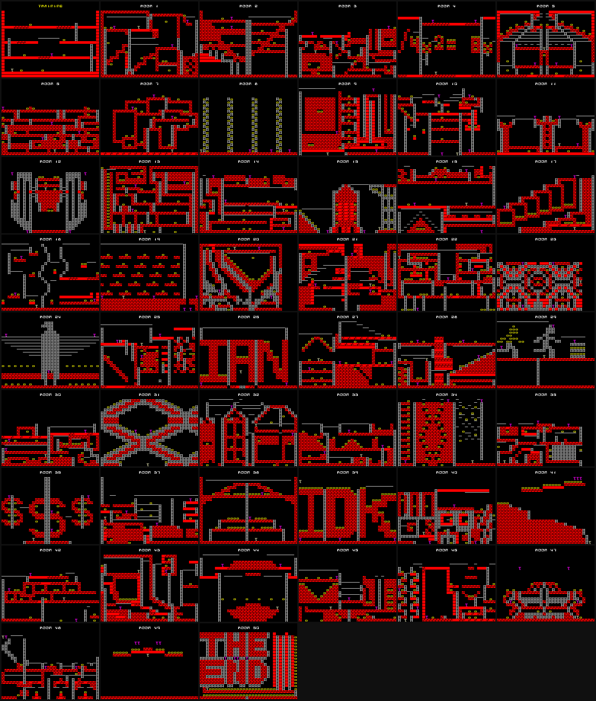

# Lode Runner for the TIKI-100

A port of Broderbund's *Lode Runner* to the Norwegian **TIKI-100** (Z80 @ 4 MHz, CP/M).

The game ships as a single CP/M executable, `loderun.com`.

* Home: <https://github.com/ovesennet/tiki-loderunner>
* Derived from the ZX Spectrum disassembly at <https://github.com/Bedazzle/Lode-runner>

## Screenshots

| Level 01 | The training level written for this port |
| --- | --- |
|  |  |

| Title screen | Level 05 |
| --- | --- |
|  |  |

## Controls

| Key | Action |
| --- | --- |
| `A` / `D` | move left / right |
| `I` / `J` | climb up / down |
| `SPACE` | dig |
| `P` | pause |
| `RETURN` | start |
| `BRYT` | quit to CP/M |

Cheat keys: `0` toggles play-without-dying and
`.` opens the room viewer. Neither is listed on the title screen.

## Building

Requires [z88dk](https://z88dk.org) (`zcc` on `PATH`)

```powershell
git clone https://github.com/ovesennet/tiki-loderunner
```


```powershell
.\build.ps1              # produce build\loderun.com and a bootable 400K image
.\build.ps1 -Clean       # discard previous build output first
```

`build.ps1` links with an automatically computed graphics origin, failing loudly if the
image, the graphics bank and the stack would collide.

## Running

Two emulators are supported. Both scripts build and deploy first, so either one is
enough on its own.

### Djupdal emulator (`tikiemul.exe`)

Bundled with the repository, boots in about a second, and is the quickest way to simply
play.

```powershell
.\deploy.ps1                 # build, write dsk\work.dsk, launch the emulator
.\deploy.ps1 -AutoStart      # same, but the disk boots straight into the game
.\deploy.ps1 -NoLaunch       # deploy only
.\tools\boot.ps1             # launch and type through the menu for you
```

Without `-AutoStart` the machine comes up in the TIKI menu: press `A` to leave it,
`RETURN` for CP/M, then type `LODERUN`.

### MAME

Needs MAME plus a `tiki100` ROM set — run `tools\make-mame-romset.py` once to build one
from the `tiki.rom` in this repository.

```powershell
.\tools\mame.ps1 -Interactive              # build, deploy, boot and play
.\tools\mame.ps1 -NoBuild -Interactive     # play the existing build
.\tools\mame.ps1 -AutoStart -Interactive   # boot straight into the game
```

In interactive mode MAME shows its red ROM warning first; dismiss it with `RETURN`.
The `BRYT` key is `ESC` on a PC keyboard.

MAME is slower to start but emulates the Z80 CTC, the AY-3-8912 and the interrupt daisy
chain properly, so it is the one to use for sound. It can also be driven entirely from
its own Lua engine, which is what the test suite relies on:

```powershell
.\tools\mame.ps1 -Shot build\shot.png                       # boot and screenshot
.\tools\mame.ps1 -NoBuild -AutoStart -Steps "wait:1100;snap;quit"
.\tools\mame.ps1 -Wav build\sound.wav                       # record the AY output
```

Scripted runs use no host keyboard or mouse input, so they neither steal focus nor
depend on sleep timings.

### Ready-made disks

`dsk/` holds four self-booting images, one per TIKI-100 drive format, each containing
`LODERUN.COM` and a handful of CP/M utilities. Put one in drive A and the machine comes
up in the title screen with nothing typed.

| Image | Format |
| --- | --- |
| `dsk/LodeRunner-t90b.dsk` | 90 KB |
| `dsk/LodeRunner-t200b.dsk` | 200 KB |
| `dsk/LodeRunner-t400b.dsk` | 400 KB |
| `dsk/LodeRunner-t800b.dsk` | 800 KB |

MAME's TIKI-100 floppy format is recognised by file size alone, so only the 400 KB image
can be used there; `tikiemul.exe` reads all four.

## Testing

```powershell
.\tests\run.ps1        # 68 gameplay checks, run on the real Z80 under MAME
.\tests\run-sound.ps1  # AY-3-8912 tone lengths and frequencies
```

The gameplay tests link the real `game.c` against stubbed I/O, run it on the emulated
machine and report each assertion over the serial console, so they exercise the shipped
Z80 code rather than a host build.

## Level map

```powershell
python .\tools\make-levelmap.py            # build\levelmap.png
python .\tools\make-levelmap.py --editor   # reveal hidden bricks and ladders
```

Draws every room into one contact sheet, decoding the shipped level tables on the host
with the same unpacking, glyph bank and palette the game uses, so the result is
pixel-identical to the emulator. Rooms are drawn at their native 256x176 under a label
strip, six to a row; the player spawn is marked in white and the guards in magenta.
`--scale`, `--cols` and `-o` are available, and `--editor` switches off the rule that
hides secret bricks and ladders during play.



## Layout

| Path | Contents |
| --- | --- |
| `src/c/` | gameplay, rooms, video, input and sound in C |
| `src/asm/` | screen, tile and sprite blitters, keyboard matrix scan, AY driver, data tables |
| `tools/` | MAME driving and host-side inspection helpers |
| `dsk/` | CP/M disk images: `workbase.dsk` is the build input, `LodeRunner-*.dsk` are ready to run |
| `tests/` | on-hardware test harness |


## How it works

The TIKI-100 is a Z80 at 4 MHz with a bitmapped display and an AY PSG. Both of
those shape the port far more than the gameplay code does.

### The display

Graphics mode 3 gives 256x256 pixels in 16 colours from a programmable palette.
That is 4 bits per pixel, so a scanline is **128 bytes** and the framebuffer is a
full **32 KB** — half the Z80's entire address space.

One byte holds two pixels, and the order is the trap: the **low nibble is the
left (even) pixel, the high nibble the right (odd) one**. A pixel's address is

```
128 * y + (x >> 1)
```

The playfield is 256x192, so `TILE_Y_OFFSET = 32` centres it on the 256-pixel
raster. That offset is applied inside the blitters and nowhere else — gameplay,
collision and spawn coordinates never see it.

The palette is 16 `RRRGGGBB` bytes set once at startup (`vid_init()` in
`src/c/video.c`). It holds the original's 16 attribute colours in their original
order, so the colour table carried over from the source game indexes it directly
with no translation.

### Bank switching, the central constraint

32 KB of video RAM cannot sit in a 64 KB map alongside a 41 KB program, so the
TIKI pages VRAM **over `$0000-$7FFF`** on demand. While that window is open the
entire bottom half of memory is gone: the running code, its stack, and every byte
it reads must live above `$7FFF`. No C library, no CP/M, no disk, no keyboard and
no sound calls can happen in there.

The glyph bank and the level tables are read-only data in *low* memory, so they
are invisible exactly when the blitter wants them. Every drawing routine therefore
runs in two phases:

1. **Expand** with normal mapping — read the glyph from low RAM and build the
   finished 4bpp pixels in a small staging buffer in high memory.
2. **Transfer** with VRAM banked — a short window that copies the staged bytes
   and touches nothing else.

This is why there is no "batch many cells into one banked window" variant: the
source data for the next cell would be unreachable. It is also why `build.ps1`
computes the graphics origin and fails the build if the image, the high-memory
code/data sections and the stack would overlap — that collision is silent and
disastrous at runtime.

The routines that must stay visible while banked live in the `code_graphics` and
`bss_graphics` sections, which the C runtime relocates above the window at startup.

### Drawing

The game keeps three representations and never conflates them: the **collision
grid** used by movement and the guard AI, the **visual layer** that records what
is actually on screen, and the **actor records**. Terrain is always repainted from
the visual layer, never from the collision grid — the grid carries temporary
"a guard is standing here" markers that would otherwise be drawn as bricks.

Rather than the original's XOR draw-and-erase, the renderer composes **dirty
cells**:

* **Terrain** (`src/asm/tiles.asm`) expands a 1bpp 8x8 glyph into a packed 4bpp
  tile through a four-entry pixel-pair lookup built from the cell's ink and paper,
  then transfers 32 bytes to VRAM.
* **Actors** (`src/asm/sprite.asm`) are overlaid with a mask: set bits are painted,
  clear bits leave the background alone. No erase pass means no XOR residue can
  accumulate. Actors step 2 pixels from cell-aligned starts, so sprite X is always
  even — which in a 2-pixels-per-byte mode is exactly byte-aligned, and removes
  all nibble-shifting from the inner loop. An odd X is rejected rather than drawn
  wrongly.

The screen is single-buffered — there is no back buffer — so any gap between
erasing an actor and redrawing it is visible as a blink. Two rules keep it stable,
both in `actor_composite()` in `src/c/game.c`. All drawing is deferred to a single
point in the frame and fenced behind `wait_vsync()`, so compositing starts from a
consistent place in the display cycle rather than wherever the previous frame's
work happened to end (a fence that is only as good as the frame hook described
below). And each actor's **erase is skipped unless its footprint or its glyph
actually changed**, while the draw is unconditional — repainting an identical glyph
over itself is invisible, but erasing it first is exactly what makes a standing
actor blink.

### Timing

Unfinished, and the port is honest about it. `screen.asm` patches the firmware
callback at `$F057` with a tiny frame-counter ISR, but that hook is a cursor-blink
callback firing at roughly 5 Hz, not a frame interrupt — on some paths it does not
fire at all. `wait_vsync` therefore spins with a bounded ~20 ms timeout rather than
blocking, which keeps input responsive but gives no real cadence control.

The result runs at about 12 iterations per second against the original's ~25. A
proper Z80 CTC timer channel is the remaining work.

### Sound

The TIKI wires an **AY-3-8912A** at register-select port `$16` and data port `$17`,
clocked at 2 MHz independently of the 4 MHz CPU. Only channel A is used: the source
game drives a 1-bit beeper, so a single square-wave voice is the faithful mapping.

`src/asm/sound.asm` is hand-written instead of using z88dk's `psg_*` helpers
because of one hardware detail with very visible consequences:

> **AY register 14 is the PSG's I/O port A, and on the TIKI port A drives the video
> scroll latch.** Writing it scrolls the screen — that is precisely how z88dk's
> `gr_vscroll()` is implemented, and `psg_init()` zeroes the whole register file,
> so it would scroll the display as a side effect of initialising sound.

The driver touches only R0, R1, R7 and R8, and writes R7 only as `$7E` or `$7F` so
that bit 6 always holds port A in output mode. A distorted or vertically offset
screen is the signature of a stray R14 write. Register select and data writes are
issued with interrupts masked so the pair cannot be split.

Pitches are converted from the original's beeper arguments. Measured against that
routine's inner loop it produces `f = 437500 / (HL + 30.125)` Hz for `(DE + 1)`
cycles; the AY gives `f = 2000000 / (16 * period)`. Equating them yields

```
period = (2 * HL + 60) / 7          duration_ms = (DE + 1) * (2 * HL + 60) / 875
```

Both stay in 16-bit integer arithmetic — there is no FPU, and a 32-bit divide per
step was enough to audibly stretch the death sweep.

Effects **block**, deliberately. The original's beeper routine holds the CPU, so
the pauses it creates are part of the game's rhythm; the ~2.9 second falling sweep
on death is a feature, not a stall. `tests\run-sound.ps1` records the emulated AY
and measures every tone's length and frequency.

## Notes on the port

* **50 rooms** ship, thinned from the original 75 to fit the TIKI's memory alongside the
  720-byte-per-room unpacked grid. The middle room of every consecutive triple is
  dropped, which keeps the difficulty curve monotonic and preserves the first and last
  rooms. The 50 that ship are byte-identical to their originals.
* A training room 0 written for this port precedes room 1.

## Third-party material

The TIKI-100 ROM, the Djupdal emulator and the CP/M system utilities on the disk images
are not covered by this project's licence and are included only to make the build
reproducible.

The level, glyph and spawn tables are derived from the ZX Spectrum disassembly at
[Bedazzle/Lode-runner](https://github.com/Bedazzle/Lode-runner), with thanks.

*Lode Runner* was created by Doug Smith and published by Broderbund, who hold the
rights to it. This is an unofficial, non-commercial port made for the TIKI-100
preservation community.

The game was created with the help of GitHub copilot and Claude Opus 5

Arctic Retro 2026
